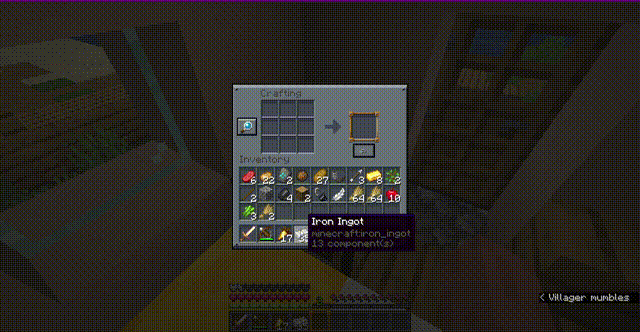
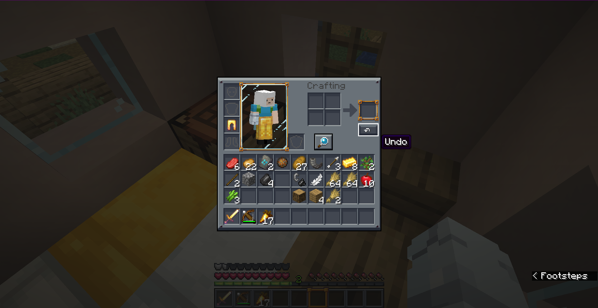
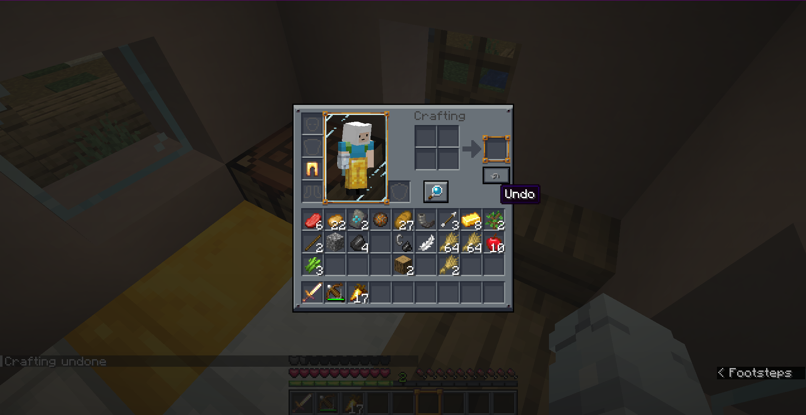
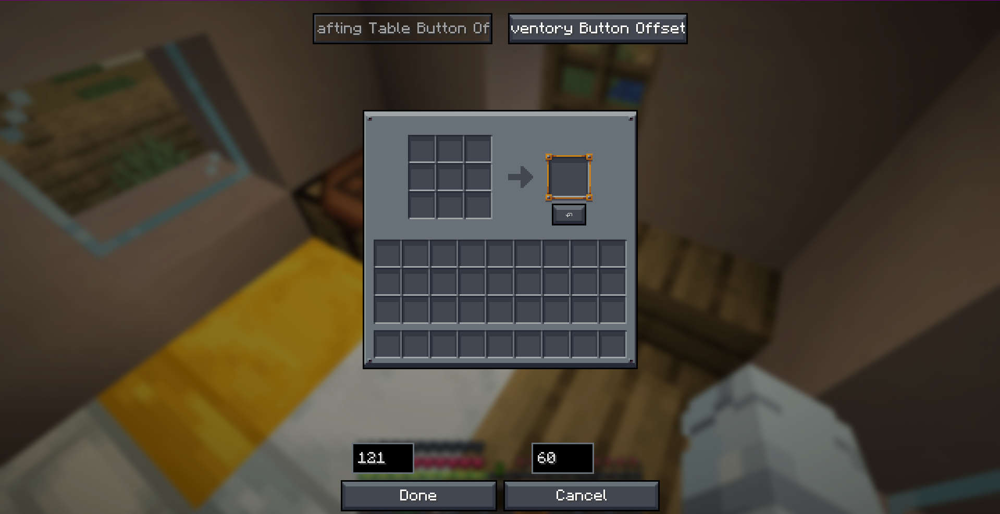
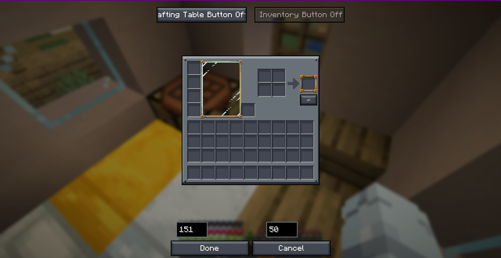

# 🔄 Undo Craft Mod

<p align="center">
  
</p>

<p align="center">
  <a href="https://github.com/Cukkoo12/undo-craft/blob/main/LICENSE"></a>
  
  
  
</p>

---

**Undo Craft** is a highly useful utility mod that allows you to undo your last crafting action. Revert accidental crafts instantly, recover all ingredients, and enjoy full control over your crafting table and inventory screens.

---

## ✨ Features

- **Consolidated Undo Actions**: Reverts individual crafts or entire shift-clicks (quick moves) as a single transaction.
- **Visual Position Editor**: Includes a fully interactive, tabbed drag-and-drop config screen accessed via ModMenu or configuration options.
- **Dual-Screen Support**: Set independent button positions for the 3x3 Crafting Table and the 2x2 Survival Inventory.
- **Client-Side Magic**: Performs client-side positioning and validation, fully compatible with server environments without requiring server-side installs!
- **Universal Port**: Full standalone subproject builds for Fabric, Forge, and NeoForge across multiple Minecraft releases.

---

## 📸 Screenshots

<p align="center">
  
  
</p>
<p align="center">
  
  
</p>

---

## 🎮 Usage

1. Open a **Crafting Table** (or your **Survival Inventory**).
2. Look for the **↶ Undo** button inside the GUI (repositionable via config).
3. If you craft the wrong item, click the **↶** button (or press `CTRL + Z`) to instantly refund all your crafting materials!

> ⚠️ **Note:** The history records only the latest transaction. The refund buffer clears upon closing the screen or performing a new craft.

---

## 📥 Platform Matrix

| Minecraft Version | Fabric | Forge | NeoForge | Subfolder Location | Java Toolchain |
|-------------------|--------|-------|----------|--------------------|----------------|
| **1.20.1**        |  ✅   |  ✅   |    ❌    | `fabric-1.20.1/` & `forge-1.20.1/` | Java 17 |
| **1.21.4**        |  ✅   |  ✅   |    ✅    | `fabric-1.21.4/`, `forge-1.21.4/`, `neoforge-1.21.4/` | Java 21 |
| **26.1.2 (Current)**| *(Root)*| ✅  |    ✅    | `forge/` & `neoforge/` (Fabric at Root) | Java 25 |

---

## 🛠️ Configuration

The mod saves its coordinate configuration in `config/undo-craft.json`. You can easily adjust the button's layout using the visual editor inside **ModMenu** (Fabric) or by using the client-side configuration screens (Forge/NeoForge).

---

## 📂 Project Structure

```
undo-craft/
├── src/                    # Fabric 26.1.2 source code (Root Project)
├── forge/                  # Forge 26.1.2 port
├── neoforge/               # NeoForge 26.1.2 port
├── fabric-1.21.4/          # Fabric 1.21.4 port
├── forge-1.21.4/           # Forge 1.21.4 port
├── neoforge-1.21.4/        # NeoForge 1.21.4 port
├── fabric-1.20.1/          # Fabric 1.20.1 port
└── forge-1.20.1/           # Forge 1.20.1 port
```

---

## 🔨 Compilation & Development

Build independent jars by executing Gradle commands in their respective directories:

```bash
# Fabric 26.1.2 (Root Project)
./gradlew build

# Minecraft 1.21.4 Ports
cd fabric-1.21.4   && ./gradlew build && cd ..
cd forge-1.21.4    && ./gradlew build && cd ..
cd neoforge-1.21.4 && ./gradlew build && cd ..

# Minecraft 1.20.1 Ports
cd fabric-1.20.1   && ./gradlew build && cd ..
cd forge-1.20.1    && ./gradlew build && cd ..
```

---

## 📝 License

This project is licensed under the **MIT License**. Check the [LICENSE](LICENSE) file for more details.

**Developer:** Musa
